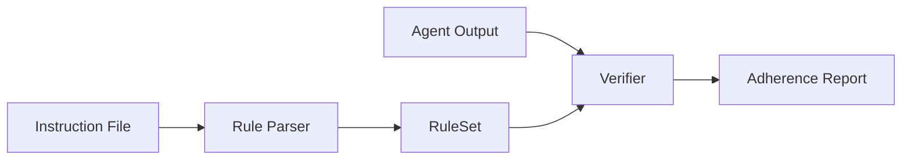

<p align="center">
  <h1 align="center">RuleProbe</h1>
  <p align="center">
    Verify whether AI coding agents actually follow the instruction files they're given.
  </p>
  <p align="center">
    <a href="https://www.npmjs.com/package/ruleprobe"></a>
    <a href="https://github.com/moonrunnerkc/ruleprobe/actions/workflows/self-check.yml"></a>
    <a href="https://github.com/moonrunnerkc/ruleprobe/blob/main/LICENSE"></a>
    
    = 18">
    <a href="https://github.com/moonrunnerkc/ruleprobe/stargazers"></a>
  </p>
</p>

## Why

Every AI coding agent reads an instruction file. None of them prove they followed it.

You write `CLAUDE.md` or `AGENTS.md` with specific rules: camelCase variables, no `any` types, named exports only, test files for every source file. The agent says "Done." But did it actually follow them? Your code review catches some violations, misses others, and doesn't scale.

RuleProbe reads the same instruction file, extracts the machine-verifiable rules, and checks agent output against each one. Compliance scores with file paths and line numbers as evidence. No LLM evaluation, no judgment calls. Deterministic and reproducible.

## Quick Start

```bash
npm install -g ruleprobe
```

Or run it directly:

```bash
npx ruleprobe --help
```

**Parse an instruction file** to see what rules RuleProbe can extract:

```bash
ruleprobe parse CLAUDE.md
ruleprobe parse AGENTS.md --show-unparseable
```

**Verify agent output** against those rules:

```bash
ruleprobe verify CLAUDE.md ./agent-output --format text
ruleprobe verify AGENTS.md ./src --format summary --threshold 0.9
```

**Analyze a whole project** across all instruction files:

```bash
ruleprobe analyze ./my-project
```

Every failure includes the file, line number, and what was found. Preference rules return compliance ratios instead of binary pass/fail.

## What It Does

**Parse.** Reads 6 instruction file formats (CLAUDE.md, AGENTS.md, .cursorrules, copilot-instructions.md, GEMINI.md, .windsurfrules) and extracts rules that can be checked mechanically. Each rule gets a qualifier (`always`, `prefer`, `when-possible`, `avoid-unless`, `try-to`, `never`) detected from the instruction text, and the markdown section it came from. Subjective instructions like "write clean code" are reported as unparseable so you know what was skipped.

**Verify.** Runs each extracted rule against a directory of agent-generated code. Six verifier engines: AST (ts-morph), filesystem, regex, tree-sitter (Python/Go), preference (compliance ratios for "prefer X over Y" patterns), and tooling (package.json/lockfile/config checks). No LLM evaluation by default; results are deterministic.

**Analyze.** Discovers all instruction files in a project, parses each, and cross-references them. Detects conflicts (same topic, contradictory rules across files) and redundancies (same rule in multiple files). Returns a coverage map showing which categories each file addresses.

**LLM Extract (opt-in).** Pass `--llm-extract` to send unparseable lines through an OpenAI-compatible API. LLM-extracted rules are labeled with `extractionMethod: 'llm'` and `confidence: 'medium'`. Requires `OPENAI_API_KEY`.

**Compare.** Point RuleProbe at outputs from two or more agents and get a side-by-side comparison table showing which rules each one followed.

**GitHub Action.** Composite action for any repo. Runs `ruleprobe verify` on every PR, posts results as a comment, and optionally outputs reviewdog rdjson format for inline annotations.

## Configuration

RuleProbe auto-discovers a config file in the working directory (or any parent). You can also pass `--config <path>` explicitly. Supported file names, in priority order:

- `ruleprobe.config.ts`
- `ruleprobe.config.js`
- `ruleprobe.config.json`
- `.ruleproberc.json`

A config file lets you add custom rules, override extracted rules, or exclude rules entirely:

```typescript
// ruleprobe.config.ts
import { defineConfig } from 'ruleprobe';

export default defineConfig({
  // Add rules that the parser can't extract from your instruction file
  rules: [
    {
      id: 'custom-no-lodash',
      category: 'import-pattern',
      description: 'Ban lodash imports',
      verifier: 'regex',
      pattern: { type: 'banned-import', target: '*.ts', expected: 'lodash', scope: 'file' },
    },
  ],

  // Change severity or expected values on extracted rules
  overrides: [
    { ruleId: 'naming-camelcase', severity: 'warning' },
    { ruleId: 'structure-max-file-length', expected: '500' },
  ],

  // Remove rules you don't want checked
  exclude: ['forbidden-no-console-log'],
});
```

`defineConfig()` is a no-op passthrough that provides type checking in TypeScript configs. JSON configs work without it.

Custom rules use the same verifier types (`ast`, `regex`, `filesystem`, `preference`, `tooling`) and pattern types as extracted rules. Any pattern type listed in the Supported Rule Types table works as a custom rule pattern.

## CLI Reference

### `ruleprobe parse <instruction-file>`

Extract rules from an instruction file.

```bash
ruleprobe parse CLAUDE.md --format json
ruleprobe parse AGENTS.md --show-unparseable
ruleprobe parse AGENTS.md --llm-extract --show-unparseable
```

`--format json|text` controls output format. `--show-unparseable` includes lines that couldn't be converted to rules. `--llm-extract` sends unparseable lines to an OpenAI-compatible API for additional extraction (requires `OPENAI_API_KEY`).

### `ruleprobe verify <instruction-file> <output-dir>`

Check agent output against extracted rules.

```bash
ruleprobe verify CLAUDE.md ./output --format text
ruleprobe verify AGENTS.md ./output --format summary --threshold 0.9
ruleprobe verify AGENTS.md ./output --agent claude --model opus-4 --format json --output report.json
ruleprobe verify AGENTS.md ./output --format detailed --severity error
ruleprobe verify AGENTS.md ./output --format ci
ruleprobe verify AGENTS.md ./output --format rdjson
ruleprobe verify AGENTS.md ./output --config ruleprobe.config.ts
ruleprobe verify AGENTS.md ./output --llm-extract
ruleprobe verify AGENTS.md ./output --rubric-decompose
ruleprobe verify AGENTS.md ./output --project tsconfig.json
```

| Option | Description |
|--------|-------------|
| `--format` | `text`, `json`, `markdown`, `rdjson`, `summary`, `detailed`, or `ci` |
| `--threshold` | Compliance threshold (0-1) for pass/fail determination (default: 0.8) |
| `--agent`, `--model` | Tag report metadata |
| `--severity` | Filter: `error`, `warning`, or `all` |
| `--output` | Write report to file instead of stdout |
| `--config` | Path to config file (otherwise auto-discovered) |
| `--llm-extract` | Run LLM extraction on unparseable lines (requires `OPENAI_API_KEY`) |
| `--rubric-decompose` | Decompose subjective rules via LLM (requires `OPENAI_API_KEY`) |
| `--project` | tsconfig.json path for type-aware checks |

Format highlights: `summary` outputs a compact per-category table. `detailed` shows per-rule compliance percentages with evidence. `ci` produces key=value output with GitHub Actions `::error` annotations.

Exit codes: `0` all rules passed, `1` violations found, `2` execution error.

### `ruleprobe compare <instruction-file> <dirs...>`

Compare multiple agent outputs against the same rules.

```bash
ruleprobe compare AGENTS.md ./claude-output ./copilot-output --agents claude,copilot --format markdown
```

### `ruleprobe analyze <project-dir>`

Discover all instruction files in a project, parse each, and report cross-file conflicts and redundancies.

```bash
ruleprobe analyze ./my-project --format text
ruleprobe analyze ./my-project --format json --output analysis.json
```

Checks for `CLAUDE.md`, `AGENTS.md`, `.cursorrules`, `.github/copilot-instructions.md`, `GEMINI.md`, and `.windsurfrules` at the project root. Reports per-file rule counts, cross-file conflicts (same topic, contradictory instructions), redundancies (same rule in multiple files), and a category coverage map.

### `ruleprobe tasks` / `ruleprobe task <id>`

List available task templates or output a specific task prompt. Three templates ship: `rest-endpoint`, `utility-module`, `react-component`.

```bash
ruleprobe tasks
ruleprobe task rest-endpoint
```

### `ruleprobe run <instruction-file>`

Invoke an AI agent on a task template, verify the output, and print the report in one step. Requires `@anthropic-ai/claude-agent-sdk` and `ANTHROPIC_API_KEY` for SDK mode. Alternatively, use `--watch` to point at a directory where you (or another agent) will write output manually.

```bash
# SDK mode: invoke Claude, verify, report
ruleprobe run CLAUDE.md --task rest-endpoint --agent claude-code --model sonnet --format text

# Watch mode: wait for output in a directory, then verify
ruleprobe run CLAUDE.md --watch ./agent-output --timeout 300 --format json
```

Options: `--task`, `--agent`, `--model`, `--format`, `--output-dir`, `--watch`, `--timeout`, `--allow-symlinks`, `--config`.

## GitHub Action

Drop this into `.github/workflows/ruleprobe.yml`:

```yaml
name: RuleProbe
on: [pull_request]
jobs:
  check-rules:
    runs-on: ubuntu-latest
    permissions:
      contents: read
      pull-requests: write
    steps:
      - uses: actions/checkout@v4
      - uses: moonrunnerkc/ruleprobe@v2
        with:
          instruction-file: AGENTS.md
          output-dir: src
        env:
          GITHUB_TOKEN: ${{ secrets.GITHUB_TOKEN }}
```

That's it. No API keys, no LLM calls, deterministic results, runs in seconds.

> **Note:** `@v2` tracks the latest v2.x release. Pin to a specific tag (e.g., `@v2.0.0`) for reproducible builds.

<details>
<summary>Full options</summary>

```yaml
- uses: moonrunnerkc/ruleprobe@v2
  with:
    instruction-file: AGENTS.md
    output-dir: src
    agent: ci
    model: unknown
    format: text
    severity: all
    fail-on-violation: "true"
    post-comment: "true"
    reviewdog-format: "false"
```

| Input | Default | Description |
|-------|---------|-------------|
| `instruction-file` | (required) | Path to instruction file |
| `output-dir` | `src` | Directory containing code to verify |
| `agent` | `ci` | Agent identifier for report metadata |
| `model` | `unknown` | Model identifier for report metadata |
| `format` | `text` | Report format: text, json, or markdown |
| `severity` | `all` | Filter: error, warning, or all |
| `fail-on-violation` | `true` | Fail the check on any violation |
| `post-comment` | `true` | Post results as a PR comment |
| `reviewdog-format` | `false` | Also output rdjson for reviewdog |

Outputs: `score`, `passed`, `failed`, `total` (available to downstream steps).

</details>

## Programmatic API

Core pipeline functions, plus project analysis, config, and LLM extraction:

| Function | Purpose |
|----------|---------|
| `parseInstructionFile(path)` | Parse an instruction file into a `RuleSet` |
| `verifyOutput(ruleSet, dir, options?)` | Run rules against a code directory (returns `Promise<RuleResult[]>`) |
| `generateReport(run, ruleSet, results)` | Build an `AdherenceReport` with summary stats |
| `formatReport(report, format)` | Render as text, JSON, markdown, rdjson, summary, detailed, or ci |
| `extractRules(markdown, fileType)` | Extract rules from raw markdown content |
| `analyzeProject(projectDir)` | Discover all instruction files, parse, detect conflicts/redundancies |
| `discoverInstructionFiles(projectDir)` | Find instruction files in a project directory |
| `defineConfig(config)` | Type-safe config helper for ruleprobe.config.ts |
| `loadConfig(path?, searchDir?)` | Load and validate a config file |
| `applyConfig(ruleSet, config)` | Merge custom rules, overrides, and exclusions into a RuleSet |
| `extractWithLlm(ruleSet, options)` | Run LLM extraction on unparseable lines |
| `createOpenAiProvider(config?)` | Create an OpenAI-compatible LLM provider |

```typescript
import { parseInstructionFile, verifyOutput, generateReport, formatReport } from 'ruleprobe';

const ruleSet = parseInstructionFile('CLAUDE.md');
const results = await verifyOutput(ruleSet, './agent-output');
const report = generateReport(
  { agent: 'claude-code', model: 'opus-4', taskTemplateId: 'rest-endpoint',
    outputDir: './agent-output', timestamp: new Date().toISOString(), durationSeconds: null },
  ruleSet,
  results,
);
console.log(formatReport(report, 'summary'));
```

**Project-level analysis:**

```typescript
import { analyzeProject } from 'ruleprobe';

const analysis = analyzeProject('./my-project');
console.log(`${analysis.files.length} instruction files found`);
console.log(`${analysis.conflicts.length} cross-file conflicts`);
console.log(`${analysis.redundancies.length} redundancies`);
```

**LLM-assisted extraction** (opt-in):

```typescript
import { parseInstructionFile, extractWithLlm, createOpenAiProvider } from 'ruleprobe';

const ruleSet = parseInstructionFile('CLAUDE.md');
const provider = createOpenAiProvider({ model: 'gpt-4o-mini' });
const enhanced = await extractWithLlm(ruleSet, { provider });
// enhanced.rules now includes LLM-extracted rules with extractionMethod: 'llm'
```

## How It Works



The parser reads your instruction file and identifies lines that map to deterministic checks. Each rule gets a category, a verifier type, a pattern, and a qualifier (how strictly the instruction is worded). Six verifier engines handle different rule types: ts-morph AST analysis for code structure, filesystem checks for naming and directory structure, regex for content patterns, tree-sitter for Python/Go, a preference engine that counts "prefer X over Y" compliance ratios, and a tooling engine that checks package.json/lockfiles/configs. The report collects compliance scores with evidence for every rule.

## Supported Rule Types

78 built-in matchers across 13 categories:

| Category | Count | Verifier(s) | Examples |
|----------|------:|-------------|----------|
| naming | 7 | AST, Filesystem, Tree-sitter | camelCase variables, PascalCase types, kebab-case files |
| forbidden-pattern | 5 | AST, Regex | no `any`, no `console.log`, no `eval` |
| structure | 9 | AST, Filesystem | strict mode, named exports, JSDoc, max file length |
| test-requirement | 5 | AST, Filesystem, Regex | test file existence, test naming conventions |
| import-pattern | 6 | AST, Regex | no path aliases, no barrel imports, no wildcard imports |
| error-handling | 2 | AST | no empty catch, no swallowed errors |
| type-safety | 5 | AST, Regex | no type assertions, no non-null assertions, no enums |
| code-style | 10 | AST, Regex, Tree-sitter | early returns, no magic numbers, no nested ternaries |
| dependency | 1 | Filesystem | pinned dependency versions |
| preference | 8 | Preference | const over let, named over default exports, interface over type, async/await over .then() |
| file-structure | 5 | Filesystem | tests directory, components directory, .env file, module index files |
| tooling | 9 | Tooling | pnpm/yarn/bun, vitest/jest/pytest, eslint/prettier/biome |
| testing | 3 | Filesystem, Regex | test colocation, describe/it blocks, no console in tests |

Full table with example instructions and check details: [docs/matchers.md](docs/matchers.md)

### Compliance scoring

Every rule result includes a `compliance` field (0 to 1):

- **Deterministic checks** (file exists, no `any` types): compliance is 0 or 1
- **Preference checks** (prefer const over let): compliance is the ratio (0.85 = 85% const usage)
- **Coverage checks** (test colocation): compliance is the percentage of source files with tests
- **Tooling checks**: compliance is 1 if present, 0.5 if present with a competitor, 0 if absent

The `--threshold` option (default 0.8) controls what compliance level counts as passing.

## Authentication

Most of RuleProbe works offline with no API keys. Two opt-in features use external APIs:

| Feature | Flag(s) | Required env var | When you need it |
|---------|---------|-----------------|------------------|
| LLM rule extraction | `--llm-extract` | `OPENAI_API_KEY` | Extracting rules from unparseable instruction lines |
| Rubric decomposition | `--rubric-decompose` | `OPENAI_API_KEY` | Breaking subjective rules into concrete checks |
| Agent invocation (SDK mode) | `ruleprobe run --agent claude-code` | `ANTHROPIC_API_KEY` | Invoking Claude to generate code, then verifying |
| GitHub Action | `uses: moonrunnerkc/ruleprobe@v2` | `GITHUB_TOKEN` | CI, PR comments |

`parse`, `verify`, `compare`, `analyze`, `tasks`, and `task` work entirely offline. No key needed.

## Tree-sitter Support

Python and Go get naming and function-length checks via tree-sitter WASM grammars. The grammar packages (`tree-sitter-python`, `tree-sitter-go`, `web-tree-sitter`) ship as regular dependencies; no extra install step is required. WASM binaries are loaded at runtime from the installed packages. If loading fails (unsupported platform, missing native build), tree-sitter checks are skipped and other verifiers still run.

## Security

RuleProbe never executes scanned code, never makes network calls (unless you opt in with `--llm-extract`, `--rubric-decompose`, or `ruleprobe run`), and never modifies files in the scanned directory. User-supplied paths are resolved and bounded to the working directory; symlinks outside the project are skipped unless you pass `--allow-symlinks`. All dependencies are pinned to exact versions. See [SECURITY.md](SECURITY.md) for the full model.

## Limitations

What v2.0.0 doesn't do, stated plainly.

- **TypeScript gets the deepest coverage.** ts-morph gives full AST analysis for TypeScript and JavaScript across all 13 categories. Python and Go get naming and function-length checks via tree-sitter WASM grammars. No Rust, Java, or C# AST support yet.
- **Subjective rules stay subjective.** "Write clean code" has no deterministic check. `--rubric-decompose` uses an LLM to break subjective instructions into weighted concrete checks, tagged with `confidence: 'low'`. Lines with no measurable proxy stay in the unparseable array. Requires `OPENAI_API_KEY`.
- **Agent invocation covers Claude SDK and watch mode only.** The `run` command invokes agents via the Claude Agent SDK or watches a directory for output. Copilot, Cursor, and other agent SDKs are not integrated; use `--watch` mode for those.
- **Type-aware checks require --project.** Three checks (implicit any, unused exports, unresolved imports) need a `tsconfig.json`. Without `--project`, ts-morph parses files in isolation and these checks are skipped.
- **78 matchers, not infinite.** The parser skips lines it can't confidently map to a check. Use `--show-unparseable` to see what was missed, and `--llm-extract` or `--rubric-decompose` to handle the remainder.
- **Preference pairs are TypeScript-focused.** The 8 built-in prefer-pairs (const vs let, named vs default exports, etc.) use ts-morph AST queries. Adding pairs for other languages requires new counting functions.

## Troubleshooting

**`sh: ruleprobe: not found` after global install**
The npm bin directory may not be in `PATH`. Run `npm bin -g` to find it and add it to your shell profile, or use `npx ruleprobe` instead.

**`Error: OPENAI_API_KEY not set`**
`--llm-extract` and `--rubric-decompose` require an OpenAI-compatible API key. Export it before running: `export OPENAI_API_KEY=sk-...`. The key is never written to disk or included in reports.

**Tree-sitter checks skipped for Python/Go**
The WASM grammars load from the installed `tree-sitter-python` and `tree-sitter-go` packages. If those packages are missing (e.g., after a partial install) or the platform doesn't support WASM, tree-sitter checks silently fall back and other verifiers still run. Re-run `npm install` to restore them.

**`ruleprobe verify` exits 2 with "path outside project root"**
A file or symlink in the output directory resolves outside the project root. Pass `--allow-symlinks` to follow symlinks across boundaries, or move the symlink targets inside the project.

**Fewer rules extracted than expected**
Run `ruleprobe parse <instruction-file> --show-unparseable` to see which lines were skipped and why. Add `--llm-extract` to attempt extraction on skipped lines.

## Case Study

See [docs/case-study-v0.1.0.md](docs/case-study-v0.1.0.md) for a comparison of two agents on the rest-endpoint task template against 10 rules.

## Contributing

```bash
git clone https://github.com/moonrunnerkc/ruleprobe.git
cd ruleprobe && npm install
npm test
```

Issues and pull requests welcome at [github.com/moonrunnerkc/ruleprobe](https://github.com/moonrunnerkc/ruleprobe).

## License

[MIT](LICENSE)
