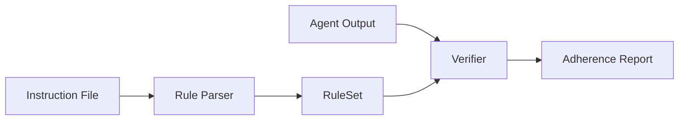

<p align="center">
  <h1 align="center">RuleProbe</h1>
  <p align="center">
    Verify whether AI coding agents actually follow the instruction files they're given.
  </p>
  <p align="center">
    <a href="https://www.npmjs.com/package/ruleprobe"></a>
    <a href="https://github.com/moonrunnerkc/ruleprobe/actions/workflows/self-check.yml"></a>
    <a href="https://github.com/moonrunnerkc/ruleprobe/blob/main/LICENSE"></a>
    
    = 18">
    <a href="https://github.com/moonrunnerkc/ruleprobe/stargazers"></a>
  </p>
</p>

## Why

Every AI coding agent reads an instruction file. None of them prove they followed it.

You write `CLAUDE.md` or `AGENTS.md` with specific rules: camelCase variables, no `any` types, named exports only, test files for every source file. The agent says "Done." But did it actually follow them? Your code review catches some violations, misses others, and doesn't scale.

RuleProbe reads the same instruction file, extracts the machine-verifiable rules, and checks agent output against each one. Binary pass/fail, with file paths and line numbers as evidence. No LLM evaluation, no judgment calls. Deterministic and reproducible.

## Quick Start

```bash
npm install -g ruleprobe
```

Or run it directly:

```bash
npx ruleprobe --help
```

**Parse an instruction file** to see what rules RuleProbe can extract:

```bash
ruleprobe parse CLAUDE.md
```

```
Extracted 14 rules:

  forbidden-no-any-type-1
    Category: forbidden-pattern
    Verifier: ast
    Pattern:  no-any (*.ts)
    Source:    "- TypeScript strict mode, no any types"

  naming-kebab-case-files-4
    Category: naming
    Verifier: filesystem
    Pattern:  kebab-case (*.ts)
    Source:    "- File names: kebab-case"
  ...
```

**Verify agent output** against those rules:

```bash
ruleprobe verify CLAUDE.md ./agent-output --format text
```

```
RuleProbe Adherence Report
Agent: unknown | Model: unknown | Task: manual

Rules: 14 total | 11 passed | 3 failed | Score: 79%

PASS  naming/naming-camelcase-variables-5
PASS  naming/naming-pascalcase-types-7
FAIL  forbidden-pattern/forbidden-no-any-type-1
      src/handler.ts:12 - found: req: any
      src/handler.ts:24 - found: data: any
FAIL  forbidden-pattern/forbidden-no-console-log-10
      src/handler.ts:18 - found: console.log("handling request")
FAIL  test-requirement/test-files-exist-11
      src/handler.ts - found: no test file found
```

Every failure includes the file, line number, and what was found. No ambiguity.

## What It Does

**Parse.** Reads 6 instruction file formats (CLAUDE.md, AGENTS.md, .cursorrules, copilot-instructions.md, GEMINI.md, .windsurfrules) and extracts rules that can be checked mechanically. Subjective instructions like "write clean code" are reported as unparseable so you know what was skipped.

**Verify.** Runs each extracted rule against a directory of agent-generated code. Checks use AST parsing via ts-morph, file system inspection, and regex pattern matching. No LLM evaluation at any stage by default; results are deterministic and identical across runs.

**LLM Extract (opt-in).** Pass `--llm-extract` to send unparseable lines through an OpenAI-compatible API for a second extraction pass. LLM-extracted rules are labeled with `extractionMethod: 'llm'` and `confidence: 'medium'`, and default to warning severity. Requires `OPENAI_API_KEY` env var. No LLM dependency is installed by default.

**Compare.** Point RuleProbe at outputs from two or more agents and get a side-by-side comparison table showing which rules each one followed. Useful for evaluating agents on the same task, or tracking adherence over time.

**GitHub Action.** Ships as a composite action you can drop into any repo. Runs `ruleprobe verify` on every PR, posts results as a comment, and optionally outputs reviewdog rdjson format for inline annotations. No API keys needed beyond `GITHUB_TOKEN`.

## Configuration

RuleProbe auto-discovers a config file in the working directory (or any parent). You can also pass `--config <path>` explicitly. Supported file names, in priority order:

- `ruleprobe.config.ts`
- `ruleprobe.config.js`
- `ruleprobe.config.json`
- `.ruleproberc.json`

A config file lets you add custom rules, override extracted rules, or exclude rules entirely:

```typescript
// ruleprobe.config.ts
import { defineConfig } from 'ruleprobe';

export default defineConfig({
  // Add rules that the parser can't extract from your instruction file
  rules: [
    {
      id: 'custom-no-lodash',
      category: 'import-pattern',
      description: 'Ban lodash imports',
      verifier: 'regex',
      pattern: { type: 'banned-import', target: '*.ts', expected: 'lodash', scope: 'file' },
    },
  ],

  // Change severity or expected values on extracted rules
  overrides: [
    { ruleId: 'naming-camelcase', severity: 'warning' },
    { ruleId: 'structure-max-file-length', expected: '500' },
  ],

  // Remove rules you don't want checked
  exclude: ['forbidden-no-console-log'],
});
```

`defineConfig()` is a no-op passthrough that provides type checking in TypeScript configs. JSON configs work without it.

Custom rules use the same verifier types (`ast`, `regex`, `filesystem`) and pattern types as extracted rules. Any pattern type listed in the Supported Rule Types table works as a custom rule pattern.

## CLI Reference

### `ruleprobe parse <instruction-file>`

Extract rules from an instruction file.

```bash
ruleprobe parse CLAUDE.md --format json
ruleprobe parse AGENTS.md --show-unparseable
ruleprobe parse AGENTS.md --llm-extract --show-unparseable
```

`--format json|text` controls output format. `--show-unparseable` includes lines that couldn't be converted to rules. `--llm-extract` sends unparseable lines to an OpenAI-compatible API for additional extraction (requires `OPENAI_API_KEY`).

### `ruleprobe verify <instruction-file> <output-dir>`

Check agent output against extracted rules.

```bash
ruleprobe verify CLAUDE.md ./output --format text
ruleprobe verify AGENTS.md ./output --agent claude --model opus-4 --format json --output report.json
ruleprobe verify AGENTS.md ./output --format markdown --severity error
ruleprobe verify AGENTS.md ./output --format rdjson
ruleprobe verify AGENTS.md ./output --config ruleprobe.config.ts
ruleprobe verify AGENTS.md ./output --llm-extract
```

`--agent` and `--model` tag the report metadata. `--severity error|warning|all` filters results. `--output` writes to a file instead of stdout. `--format rdjson` produces reviewdog-compatible diagnostics. `--config` loads a specific config file (otherwise auto-discovered). `--llm-extract` runs unparseable lines through an LLM for additional rule extraction.

Exit codes: `0` all rules passed, `1` violations found, `2` execution error.

### `ruleprobe compare <instruction-file> <dirs...>`

Compare multiple agent outputs against the same rules.

```bash
ruleprobe compare AGENTS.md ./claude-output ./copilot-output --agents claude,copilot --format markdown
```

### `ruleprobe tasks` / `ruleprobe task <id>`

List available task templates or output a specific task prompt. Three templates ship with v0.1.0: `rest-endpoint`, `utility-module`, `react-component`.

```bash
ruleprobe tasks
ruleprobe task rest-endpoint
```

## GitHub Action

Drop this into `.github/workflows/ruleprobe.yml`:

```yaml
name: RuleProbe
on: [pull_request]
jobs:
  check-rules:
    runs-on: ubuntu-latest
    permissions:
      contents: read
      pull-requests: write
    steps:
      - uses: actions/checkout@v4
      - uses: moonrunnerkc/ruleprobe@v0.1.0
        with:
          instruction-file: AGENTS.md
          output-dir: src
        env:
          GITHUB_TOKEN: ${{ secrets.GITHUB_TOKEN }}
```

That's it. No API keys, no LLM calls, deterministic results, runs in seconds.

<details>
<summary>Full options</summary>

```yaml
- uses: moonrunnerkc/ruleprobe@v0.1.0
  with:
    instruction-file: AGENTS.md
    output-dir: src
    agent: ci
    model: unknown
    format: text
    severity: all
    fail-on-violation: "true"
    post-comment: "true"
    reviewdog-format: "false"
```

| Input | Default | Description |
|-------|---------|-------------|
| `instruction-file` | (required) | Path to instruction file |
| `output-dir` | `src` | Directory containing code to verify |
| `agent` | `ci` | Agent identifier for report metadata |
| `model` | `unknown` | Model identifier for report metadata |
| `format` | `text` | Report format: text, json, or markdown |
| `severity` | `all` | Filter: error, warning, or all |
| `fail-on-violation` | `true` | Fail the check on any violation |
| `post-comment` | `true` | Post results as a PR comment |
| `reviewdog-format` | `false` | Also output rdjson for reviewdog |

Outputs: `score`, `passed`, `failed`, `total` (available to downstream steps).

</details>

## Programmatic API

Five functions cover the full pipeline:

| Function | Purpose |
|----------|---------|
| `parseInstructionFile(path)` | Parse an instruction file into a `RuleSet` |
| `verifyOutput(ruleSet, dir)` | Run rules against a code directory |
| `generateReport(run, ruleSet, results)` | Build an `AdherenceReport` with summary stats |
| `formatReport(report, format)` | Render as text, JSON, markdown, or rdjson |
| `extractRules(markdown, fileType)` | Extract rules from raw markdown content |
| `defineConfig(config)` | Type-safe config helper for ruleprobe.config.ts |
| `loadConfig(path?, searchDir?)` | Load and validate a config file |
| `applyConfig(ruleSet, config)` | Merge custom rules, overrides, and exclusions into a RuleSet |
| `extractWithLlm(ruleSet, options)` | Run LLM extraction on unparseable lines |
| `createOpenAiProvider(config?)` | Create an OpenAI-compatible LLM provider |

```typescript
import { parseInstructionFile, verifyOutput, generateReport, formatReport } from 'ruleprobe';

const ruleSet = parseInstructionFile('CLAUDE.md');
const results = verifyOutput(ruleSet, './agent-output');
const report = generateReport(
  { agent: 'claude-code', model: 'opus-4', taskTemplateId: 'rest-endpoint',
    outputDir: './agent-output', timestamp: new Date().toISOString(), durationSeconds: null },
  ruleSet,
  results,
);
console.log(formatReport(report, 'text'));
```

**LLM-assisted extraction** (opt-in):

```typescript
import { parseInstructionFile, extractWithLlm, createOpenAiProvider } from 'ruleprobe';

const ruleSet = parseInstructionFile('CLAUDE.md');
const provider = createOpenAiProvider({ model: 'gpt-4o-mini' });
const enhanced = await extractWithLlm(ruleSet, { provider });
// enhanced.rules now includes LLM-extracted rules with extractionMethod: 'llm'
```

## How It Works



The parser reads your instruction file and identifies lines that map to deterministic checks (naming conventions, forbidden patterns, structural requirements). Each rule gets a category, a verifier type, and a pattern. The verifier walks the agent's output directory, runs AST checks via ts-morph for code structure rules, file system checks for naming and test file requirements, and regex checks for line length and content patterns. The report collects pass/fail results with evidence for every rule.

## Supported Rule Types

| Category | Example instruction | What gets checked | Verifier |
|----------|-------------------|-------------------|----------|
| naming | "camelCase for variables" | Variable and function names in AST | AST |
| naming | "camelCase" (general) | Variable and function names in AST | AST |
| naming | "PascalCase for types" | Interface and type alias names | AST |
| naming | "kebab-case file names" | File names on disk | Filesystem |
| forbidden-pattern | "no any types" | Type annotations in AST | AST |
| forbidden-pattern | "no console.log" | Call expressions in AST | AST |
| forbidden-pattern | "no console.warn/error" | Extended console method calls | AST |
| forbidden-pattern | "max line length" | Line character count | Regex |
| structure | "named exports only" | Export declarations | AST |
| structure | "JSDoc on public functions" | JSDoc presence | AST |
| structure | "max 300 lines per file" | File line count | Filesystem |
| structure | "strict mode" | tsconfig.json compilerOptions.strict | Filesystem |
| structure | "no barrel files" | Index re-export detection | AST |
| structure | "README must exist" | File existence on disk | Filesystem |
| structure | "CHANGELOG must exist" | File existence on disk | Filesystem |
| structure | "formatter config required" | .prettierrc / .eslintrc detection | Filesystem |
| test-requirement | "test file for every source file" | Matching test files exist | Filesystem |
| test-requirement | "test files named *.test.ts" | Test file naming convention | Filesystem |
| test-requirement | "no .only in tests" | Focused test detection | Regex |
| test-requirement | "no .skip in tests" | Skipped test detection | Regex |
| test-requirement | "no setTimeout in tests" | Timer usage in test files | AST |
| import-pattern | "no path aliases" | Import specifiers | AST |
| import-pattern | "no deep relative imports" | Import depth | AST |
| import-pattern | "no namespace imports" | Star import detection | AST |
| import-pattern | "ban specific packages" | Forbidden import sources | Regex |
| error-handling | "no empty catch blocks" | Catch clause body inspection | AST |
| error-handling | "throw Error instances only" | Throw expression types | AST |
| type-safety | "no enums" | Enum declaration detection | AST |
| type-safety | "no type assertions" | `as` keyword / angle bracket casts | AST |
| type-safety | "no non-null assertions" | `!` postfix operator | AST |
| type-safety | "no @ts-ignore / @ts-nocheck" | Directive comment detection | Regex |
| code-style | "no nested ternary" | Ternary depth analysis | AST |
| code-style | "no magic numbers" | Numeric literal usage | AST |
| code-style | "no else after return" | Redundant else branches | AST |
| code-style | "max function length" | Function body line count | AST |
| code-style | "max parameters per function" | Parameter count | AST |
| code-style | "single/double quote style" | Quote consistency in imports | Regex |
| dependency | "pin dependency versions" | Exact version strings in package.json | Filesystem |

38 matchers across 9 categories. The parser is conservative: if it can't confidently map an instruction to a check, it skips it and reports the line as unparseable.

## Security

RuleProbe never executes scanned code, never makes network calls, and never modifies files in the scanned directory. User-supplied paths are resolved and bounded to the working directory; symlinks outside the project are skipped unless you pass `--allow-symlinks`. All dependencies are pinned to exact versions. See [SECURITY.md](SECURITY.md) for the full model.

## Limitations

These are things v0.1.0 doesn't do. Stated plainly so you know before installing.

- **TypeScript and JavaScript only.** AST checks use ts-morph. Other languages aren't supported.
- **No subjective evaluation.** "Write clean code" can't be verified mechanically. Those lines show up in the unparseable array. `--llm-extract` can attempt to map some of them to existing checks, but subjective instructions remain unparseable.
- **No automated agent invocation.** You run the agent yourself and point RuleProbe at the output directory. Automated invocation is planned for v0.2.0.
- **Conservative extraction.** The parser would rather skip a rule than misclassify it. 38 matchers cover the most common instruction patterns. Check `--show-unparseable` to see what was missed.
- **No compilation required.** ts-morph parses files in isolation, so it can analyze code that wouldn't compile. This is intentional (agent output often has errors), but it means some type-level checks are limited.

## Case Study

See [docs/case-study-v0.1.0.md](docs/case-study-v0.1.0.md) for a comparison of two agents on the rest-endpoint task template against 10 rules.

## Contributing

```bash
git clone https://github.com/moonrunnerkc/ruleprobe.git
cd ruleprobe && npm install
npm test
```

Issues and pull requests welcome at [github.com/moonrunnerkc/ruleprobe](https://github.com/moonrunnerkc/ruleprobe).

## License

[MIT](LICENSE)
