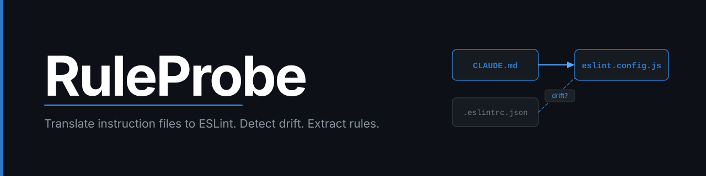

<p align="center">
  
</p>

# RuleProbe

When your `CLAUDE.md` says "use camelCase" but ESLint doesn't enforce it, drift has already happened. RuleProbe reads an instruction file and translates it to an ESLint config. It detects what each enforces but the other misses, or converts ESLint rules back to instruction prose.

[](https://www.npmjs.com/package/ruleprobe)
[](https://github.com/moonrunnerkc/ruleprobe/actions/workflows/self-check.yml)
[](https://github.com/moonrunnerkc/ruleprobe/blob/main/LICENSE)
[](https://www.typescriptlang.org)
[](https://nodejs.org)
[](https://github.com/moonrunnerkc/ruleprobe/stargazers)

## Installation

Requires Node.js 18 or later.

```bash
npm install -g ruleprobe
```

Or try it without installing:

```bash
npx ruleprobe --help
```

Confirm it's working:

```bash
ruleprobe --version
# 4.5.0
```

## Usage

For maintainers who use AI coding agents and ESLint. Works with any instruction file format your agents read.

**Translate an instruction file to an ESLint config:**

```bash
ruleprobe lint-config CLAUDE.md
ruleprobe lint-config AGENTS.md --format legacy --output .eslintrc.json
```

**Detect drift between an instruction file and an existing ESLint config:**

```bash
ruleprobe drift CLAUDE.md .eslintrc.json
ruleprobe drift CLAUDE.md .eslintrc.json --format markdown
```

**Convert ESLint rules back to instruction prose:**

```bash
ruleprobe extract .eslintrc.json
ruleprobe extract .eslintrc.json --output rules-section.md
```

**See what rules RuleProbe can parse from an instruction file:**

```bash
ruleprobe parse CLAUDE.md --show-unparseable
```

**Check code against extracted rules (legacy verify mode):**

```bash
ruleprobe verify AGENTS.md ./src --changed-since origin/main
```

**Discover and cross-reference all instruction files in a project:**

```bash
ruleprobe analyze ./my-project --format json
```

Seven instruction file formats are supported: `CLAUDE.md`, `AGENTS.md`, `.cursorrules`, `copilot-instructions.md`, `GEMINI.md`, `.windsurfrules`, `.rules`. Full flag reference: [docs/cli-reference.md](docs/cli-reference.md)

## Configuration

RuleProbe auto-discovers a config file in the working directory or any parent. Pass `--config <path>` to override. Supported names, in priority order: `ruleprobe.config.ts`, `ruleprobe.config.js`, `ruleprobe.config.json`, `.ruleproberc.json`.

```typescript
// ruleprobe.config.ts
import { defineConfig } from 'ruleprobe';

export default defineConfig({
  // Rules the parser can't extract from your instruction file
  rules: [
    {
      id: 'custom-no-lodash',
      category: 'import-pattern',
      description: 'Ban lodash imports',
      verifier: 'regex',
      pattern: { type: 'banned-import', target: '*.ts', expected: 'lodash', scope: 'file' },
    },
  ],

  // Change severity or thresholds on extracted rules
  overrides: [
    { ruleId: 'naming-camelcase', severity: 'warning' },
    { ruleId: 'structure-max-file-length', expected: '500' },
  ],

  // Remove rules you don't want checked
  exclude: ['forbidden-no-console-log'],
});
```

`defineConfig()` is a no-op passthrough that provides TypeScript type checking.

## GitHub Action

Add drift detection to every pull request (PR):

```yaml
# .github/workflows/ruleprobe.yml
name: RuleProbe Drift
on: [pull_request]
jobs:
  drift-check:
    runs-on: ubuntu-latest
    permissions:
      contents: read
      pull-requests: write
    steps:
      - uses: actions/checkout@v4
      - uses: moonrunnerkc/ruleprobe@v4
        with:
          instruction-file: CLAUDE.md
        env:
          GITHUB_TOKEN: ${{ secrets.GITHUB_TOKEN }}
```

No API keys needed. The action runs only when instruction files or ESLint configs change in the PR. Pin to `@v4.5.0` for reproducible builds.

<details>
<summary>Full action options</summary>

| Input | Default | Description |
|-------|---------|-------------|
| `mode` | `drift` | `drift` (default) or `verify` (legacy) |
| `instruction-file` | required | Path to instruction file |
| `eslint-file` | auto-detected | Path to ESLint config |
| `regenerate-on-drift` | `false` | Open a follow-up PR with the regenerated config |
| `comment-on-pr` | `true` | Post drift results as a PR comment |
| `fail-on-drift` | `false` | Fail the action if drift is detected |
| `changed-since` | unset | Verify mode only: git ref to diff against |

Drift mode outputs: `drift-count`, `has-drift`.

</details>

## How It Works

```
Instruction File --> Parser --> RuleSet --> Mapper  --> ESLint Config
Instruction File --> Parser --> RuleSet --.
ESLint Config    --> Parser --> Parsed  --+--> Drift Detector --> Drift Report
ESLint Config    --> Extractor           --> Markdown Rules Section
Agent Output     --> Verifier (verify mode, legacy)
```

| Engine | What it checks |
|--------|----------------|
| AST (Abstract Syntax Tree) via ts-morph | TypeScript and JavaScript structure, naming, imports, type safety |
| Tree-sitter | Python and Go: function naming, function length |
| Regex | Line-level patterns across any text file |
| Filesystem | File existence, naming conventions, directory structure |

34 ESLint-mappable matchers across 7 categories (`naming`, `forbidden-pattern`, `structure`, `import-pattern`, `error-handling`, `type-safety`, `code-style`). Rules with no ESLint equivalent appear as comments in generated configs. Full matcher table: [docs/matchers.md](docs/matchers.md)

## Programmatic API

```typescript
import { parseInstructionFile, verifyOutput, generateReport, formatReport } from 'ruleprobe';

const ruleSet = parseInstructionFile('CLAUDE.md');
const results = await verifyOutput(ruleSet, './agent-output');
const report = generateReport(
  { agent: 'claude-code', model: 'opus-4', taskTemplateId: 'manual',
    outputDir: './agent-output', timestamp: new Date().toISOString(), durationSeconds: null },
  ruleSet,
  results,
);
console.log(formatReport(report, 'summary'));
```

Full API reference: [docs/api-reference.md](docs/api-reference.md)

## Security

RuleProbe never executes scanned code, makes no network calls by default, and never writes to the scanned directory. The optional `--llm-extract`, `--rubric-decompose`, and `--semantic` flags call external APIs using your own keys. User-supplied paths are resolved and restricted to the working directory; symlinks outside it are skipped unless you pass `--allow-symlinks`. All runtime dependencies are pinned to exact versions; see [SECURITY.md](SECURITY.md) for the full model.

## Limitations

- Not all rules map to ESLint. Test file requirements, git conventions, and preference pairs are reported as unmappable so you can enforce them through other tooling.
- Monorepo drift detection scans from the repo root and uses the first ESLint config found. Specify paths explicitly for per-package instruction files or configs.

## Contributing

```bash
git clone https://github.com/moonrunnerkc/ruleprobe.git
cd ruleprobe && npm install
npm test
```

Issues and pull requests welcome at [github.com/moonrunnerkc/ruleprobe](https://github.com/moonrunnerkc/ruleprobe).

## License

[MIT](LICENSE)
